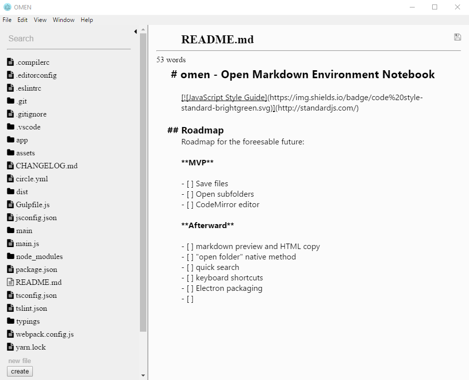

# omen - Open Markdown Environment Notebook

## Roadmap
Roadmap for the foreesable future:

**MVP**

- [X] Save files
- [ ] Open subfolders
- [X] CodeMirror editor

**Afterward**

- [ ] markdown preview and HTML copy
- [ ] "open folder" native method
- [ ] quick search
- [ ] keyboard shortcuts
- [ ] Electron packaging 

